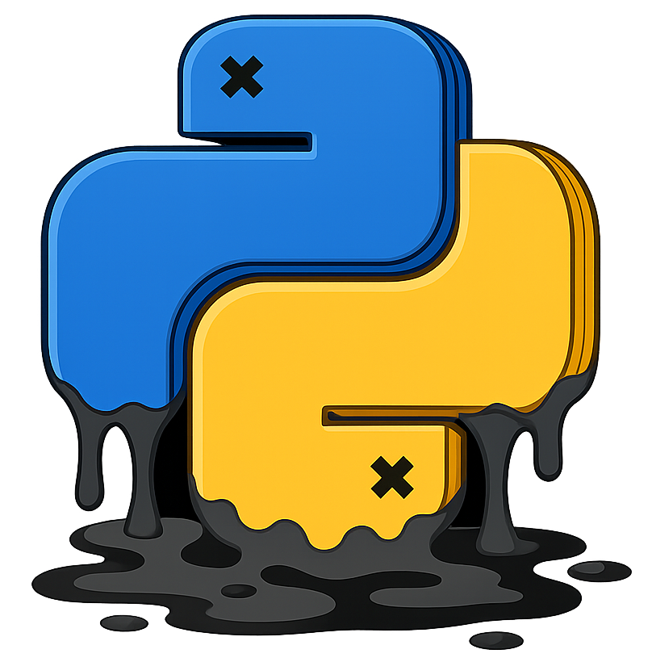

<p align="center">
  
</p>

<h2 align="center"> Python Class Pollution </h2>

This repository contains **Pyrl** (/pɜːrl/, "Pearl"), an automated detection tool for Python class pollution, together with the datasets, vulnerability collection, supporting scripts, and the source of the project website.

Python class pollution is a vulnerability class where untrusted input modifies unintended Python runtime objects via reflective attribute or item lookups. Successful exploitation can lead to RCE, authentication bypass, XSS, DoS, and token leakage. See the [project site](https://class-pollution.github.io) and the [wiki](https://class-pollution.github.io/wiki/docs/) for the taxonomy, targets, gadgets, and showcases.

## Install

Pyrl is a Python package (`pyrl`) that drives CodeQL. You will need:

- Python `>= 3.10`
- The [CodeQL CLI](https://codeql.github.com/docs/codeql-cli/) on your `PATH` (or referenced from the config)
- [`uv`](https://docs.astral.sh/uv/) (recommended) or `pip`

Clone and set up the environment:

```bash
git clone --recurse-submodules https://github.com/jackfromeast/python-class-pollution.git
cd python-class-pollution

# Install the Python package (editable)
uv sync                       # or: pip install -e .

# Install the CodeQL pack and compile the query suite
./install.sh
```

`install.sh` runs `codeql pack install` and compiles `class-pollution.qls` in `src/pyrl/codeql/class-pollution-all/`. The CodeQL CLI path used at analysis time is read from the YAML config (`CODEQL.CLI`).

## Usage

Pyrl runs analysis tasks described by a YAML config. The package exposes a `pyrl` console script:

```bash
pyrl --config tasks/cp-collection/config.yaml
```

The config selects a workflow and configures the CodeQL CLI, the worker pool, and the input list of repositories. A minimal example (see `tasks/cp-collection/config.yaml` for the full version):

```yaml
WORKFLOW:
  CLASS_POLLUTION_ANALYSIS: True
  DEPENDENCY_ANALYSIS: False

SCHEDULER:
  TEST_NAME: "CLASS-POLLUTION-CP-COLLECTION"
  WORKSPACE: "tasks/cp-collection"
  MODE: "list"                      # "seed" or "list"
  REPO_LIST: "cp-collection.txt"    # under WORKSPACE/input/ or absolute
  MAX_WORKER: 8
  TIMEOUT_PER_WORKER: 2400

CODEQL:
  CLI: "/path/to/codeql"
  THREADS: 2
  RAM: 16384
  TIMEOUT: 1200
  USE_MODEL_PACK: True
  MODEL_PACK: jackfromeast/class-pollution-model-pack@0.0.1

CLASS_POLLUTION_ANALYSIS:
  QUERY_MODE: query
  QUERIES:
    - "src/pyrl/codeql/class-pollution-all/class-pollution-external.qls"
```

Two workflows are available:

- `class_pollution` &mdash; runs the class-pollution detection query suite over each repository in `REPO_LIST` and writes SARIF results under `WORKSPACE/output/<repo>/`.
- `dependency_analysis` &mdash; runs the source / sink / summary queries used to model third-party dependencies and produce reusable library models.

You can override the workflow on the command line:

```bash
pyrl --config tasks/cp-collection/config.yaml --workflow class_pollution
```

Logs land in `WORKSPACE/logs/` (configurable under `LOG.*`). Per-repository results, including SARIF and run logs, are written under `WORKSPACE/output/<repo>/`.


## Project Layout

```
python-class-pollution/
├── src/pyrl/                  # Pyrl tool (Python package, console script: `pyrl`)
│   ├── run.py                 # CLI entry point
│   ├── workflows/             # class-pollution and dependency-analysis schedulers
│   ├── codeql_driver/         # CodeQL database build + query runner
│   ├── codeql/                # CodeQL query suites
│   │   ├── class-pollution-all/    # Main detection suite (operational taint analysis)
│   │   ├── prevalence-checker/     # Reflective get/set prevalence queries
│   │   └── library-models/         # Cached library models / model pack
│   ├── dependency_analysis/   # Per-dependency source/sink/summary analyzer
│   └── utils/                 # Config, logging, helpers
│
├── lib/polluter/              # Runtime polluter library used in PoCs / dynamic checks
├── cp-collection/             # Curated collection of confirmed class-pollution vulnerabilities,
│                              #   each with metadata + library/local/remote PoCs
├── tasks/                     # Example task workspaces (config + input + output)
│   └── cp-collection/         #   Reproduces the analysis over `cp-collection`
├── dataset/                   # Repository selection inputs
│   ├── github/                #   GitHub stars-based corpora
│   └── pip/                   #   PyPI download-based corpora
├── crawler/                   # Repository crawler (JS) used to build the corpora
├── scripts/                   # Result post-processing, table/figure generation, helpers
├── tests/                     # Query unit tests organized by feature
├── website/                   # Source for https://class-pollution.github.io (Hugo + landing)
├── install.sh                 # Installs the CodeQL pack and compiles the query suite
└── pyproject.toml             # Package metadata for `pyrl`
```

For more details on each component, see:

- Tool documentation &mdash; <https://class-pollution.github.io/wiki/docs/tool/pyrl/>
- Vulnerability showcases and CVEs &mdash; <https://class-pollution.github.io/wiki/docs/collection/>
- Full vulnerability catalog &mdash; <https://class-pollution.github.io/wiki/docs/collection/catalog/>
- Taxonomy, targets, gadgets &mdash; <https://class-pollution.github.io/wiki/docs/>

## Citation

Pyrl was presented at IEEE S&amp;P 2026 by Zhengyu Liu, Jiacheng Zhong, Jianjia Yu, Muxi Lyu, Zifeng Kang, and Yinzhi Cao. The [paper PDF](https://jackfromeast.github.io/assets/Pyrl.pdf) is linked from the project site.

```bibtex
@inproceedings{liu2026classpollution,
  title     = {The First Large-Scale Systematic Study of Python Class Pollution Vulnerability},
  author    = {Liu, Zhengyu and Zhong, Jiacheng and Yu, Jianjia and Lyu, Muxi and Kang, Zifeng and Cao, Yinzhi},
  booktitle = {2026 IEEE Symposium on Security and Privacy (SP)},
  year      = {2026}
}
```