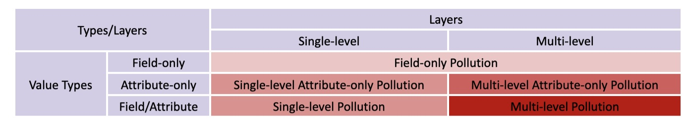

## Attack Taxonomy

The Class Pollution vulnerability aligns with CWE-915: Improperly Controlled Modification of Dynamically-Determined Object Attributes, also known as "Mass Assignment." This CWE category serves as the parent of CWE-1321: Improperly Controlled Modification of Object Prototype Attributes ('Prototype Pollution'). The distinction lies in that CWE-1321 specifically allows overwriting parent objects whose attributes are shared across other runtime objects, thereby affecting a broader scope.

To better understand the prevalence and impact of Class Pollution vulnerabilities, we propose the first comprehensive taxonomy of Class Pollution attacks, systematically categorizing them based on their scope of impact.



### 1/ Field-only Pollution

In a field-only pollution attack, an attacker can overwrite arbitrary fields within a given base object of type MutableMapping. This can result in security issues such as privilege escalation if the base dictionary contains privilege-related fields that should not be modified by the user. However, the impact of this type of pollution is limited to the targeted base object and does not extend to other objects within the runtime environment (the fields are not shared between different object directly).

The root cause of this vulnerability lies in excessive privileges being granted to the user, allowing unauthorized modification of sensitive fields.

#### PoC

The following functions demonstrate how field-only pollution can occur at both single and multi-levels in a dictionary-like structure:

```
from typing import Dict

# Single-level field-only pollution
def single_level_field_only_pollution_func(base: Dict, input: Dict) -> Dict:
    """
    Overwrites fields in the base dictionary with values from the input dictionary.
    This allows modification of any key-value pairs directly within the base object.
    """
    for key, val in input.items():
      base[key] = val
    return base

# Multi-level field-only pollution
def multi_level_field_only_pollution_func(base: Dict, input: Dict) -> Dict:
  """
  Recursively overwrites fields in a nested dictionary structure.
  If a field in the base dictionary is itself a dictionary, the function
  continues to overwrite fields at deeper levels.
  """
  for key, val in input.items():
    if isinstance(base.get(key), dict):  # Ensure the value is a dictionary
      base[key] = multi_level_field_only_pollution_func(base[key], val)
    else:
      base[key] = val  # Overwrite field if not a dictionary
  return base
```

#### Real-World Cases

+ CVE-2024-7297: Langflow Privilege Escalation through Mass Assignment
  + Reference: https://www.tenable.com/security/research/tra-2024-26

```
async def update_user(user_db: User | None, user: UserUpdate, db: AsyncSession) -> User:
    if not user_db:
        raise HTTPException(status_code=404, detail="User not found")

    # user_db_by_username = get_user_by_username(db, user.username)
    # if user_db_by_username and user_db_by_username.id != user_id:
    #     raise HTTPException(status_code=409, detail="Username already exists")

    user_data = user.model_dump(exclude_unset=True)
    changed = False
    for attr, value in user_data.items():
        if hasattr(user_db, attr) and value is not None:
            setattr(user_db, attr, value)
            changed = True
```

